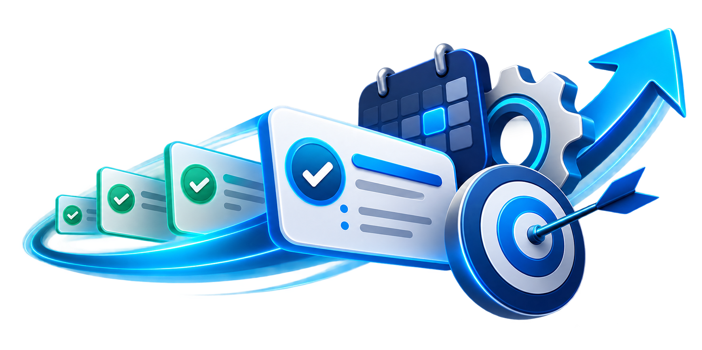

# Moves



Moves is a momentum-focused task and project workspace for work that cannot afford to stall.

Most task trackers tell you what exists. Moves helps teams see what needs attention next. Every move carries a clear next action, ownership, context, timing, and momentum signal so follow-up does not disappear between meetings.

## Why Moves exists

Work rarely fails because nobody created a task. It fails because the task becomes invisible: a proposal waits for a response, a project loses its next action, or an important relationship is disconnected from the work that serves it.

Moves makes that drift visible. It gives teams a shared execution view that answers:

- What needs attention today?
- Which work is fresh, active, stalled, or at risk?
- Who owns the next move?
- Which contact, project, or campaign is connected to it?
- What action will move the work forward?

## The value of Moves

Moves turns task tracking into an execution system:

- **Momentum visibility** — See how long work has been still and surface stalled follow-ups before they become lost opportunities.
- **Clear next actions** — Keep every task anchored to a concrete move instead of a vague status.
- **Connected context** — Link moves to projects, contacts, campaigns, and documents so execution retains its business context.
- **Operational focus** — Use the command deck and automation signals to identify schedule, status, resource, and suggested-move opportunities.
- **Revenue protection** — Keep proposals, customer commitments, and opportunities moving so delays do not quietly become lost revenue.
- **Shared accountability** — Make ownership, blockers, momentum, and the next action visible in one workspace.

## Core experience

The Moves workspace is organized around a simple loop:

1. Create a move with a clear next action.
2. Connect it to the project, contact, campaign, or document it serves.
3. Let momentum signals identify work that is drifting.
4. Act on the next move before the opportunity goes cold.

The application includes a responsive execution board, move browser, selected-move view, mission workspace, AI mission surfaces, pricing, and a Moves for iOS preview page.

## Running locally

Install dependencies and start the Angular development server:

```bash
npm install
npm start
```

Then open [http://localhost:4200](http://localhost:4200).

Useful commands:

```bash
npm run build   # production build
npm test        # test suite
```

## Design direction

Moves uses an editorial, kinetic interface: oversized typography, signal colors, responsive layouts, moving artwork, orbiting indicators, and deliberate transitions. Light and dark themes are supported on the public landing and iOS pages, with responsive behavior across the workspace routes.

## Project structure

- `src/app/features/landing` — public Moves landing page
- `src/app/features/task-home` — execution home and command deck
- `src/app/features/task-view-parent` — Moves workspace views
- `src/app/features/task-edit` — create and edit moves
- `src/app/features/app-showcase` — Moves for iOS page
- `src/app/features/moves-pricing` — pricing page
- `public/assets` — public images, logos, and product artwork

## Product language

Moves is built around one idea:

> The task is not the work. The next action is.

When the next action is visible, owned, and connected to the right context, work keeps moving.
